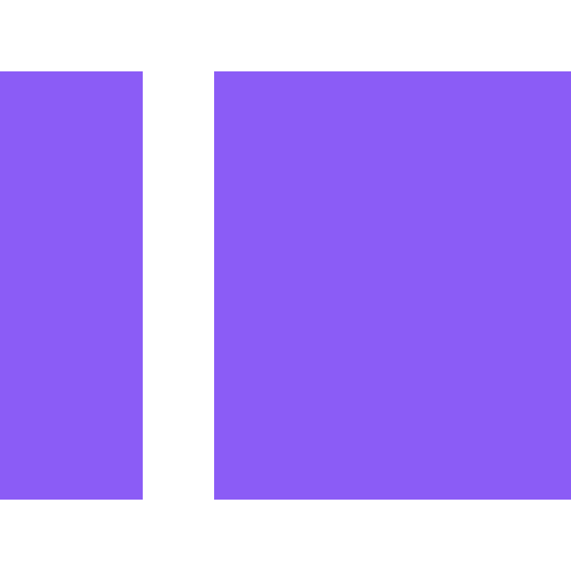

<!-- About me -->

  <h2 style="color:#3b82f6; display: flex; align-items: center; justify-content: center; gap: 10px">  About Me</h2>
  
I’m a Full-Stack Developer focused on building modern, scalable, and user-centered web applications. I enjoy working across the entire development lifecycle, from designing responsive interfaces and implementing frontend architectures to developing backend services, APIs, and database solutions.
   
   
  My experience includes building business applications with React, TypeScript, Node.js, and Express, working with both relational and NoSQL databases, and collaborating with teams to turn requirements into practical software solutions. I’m continuously expanding my knowledge of software engineering, cloud technologies, testing, and modern development practices.

<!-- Connect with me  -->

  <h2 style="color:#14B8A6; display: flex; align-items: center; justify-content: center; gap: 10px"> Connect with Me!</h2>
  
  <!--  -->
  
  

<!-- Job experience -->

  <h2 style="color:#F59E0B; display: flex; align-items: center; justify-content: center; gap: 10px">
    
    Professional Journey
  </h2>
  

    My professional journey combines full-stack software development, project leadership, and experience working with AI technologies. I’ve contributed to business applications across the frontend and backend, worked with databases and APIs, and led software projects from development through delivery.
  

  <table align="center">
  <tr>
    <td align="center" width="33%">
      <h3>Front-End Developer</h3>
      <b>Meliora AI</b> 
      Project Lead 
      <i>Feb 2025 - Jun 2025</i>  
      Led front-end development of
      a business accounting platform 
      while coordinating development
      and collaborating with stakeholders
    </td>
    <td align="center" width="33%">
      <h3>AI Model Trainer</h3>
      <b>Outlier AI</b> 
      Remote 
      <i>Dec 2024 - Feb 2025</i>  
      Evaluated AI-generated responses
      for quality, accuracy & reasoning 
      following detailed evaluation criteria
    </td>
    <td align="center" width="33%">
      <h3>Student Group Founder</h3>
      <b>Noob Games</b> 
      Founder 
      <i>Aug 2022 - Jun 2023</i>  
      Founded and led a student
      game development community 
      while organizing technical
      training and collaborative projects
    </td>
  </tr>
</table>

<!-- Programming Languages -->

  <h2 style="color:#06B6D4; display: flex; align-items: center; justify-content: center; gap: 10px">
    
    Programming Languages
  </h2>
  
I work primarily with JavaScript and TypeScript for modern web development, while also having experience with C++, C#, and Python through software, game development, automation, and academic projects.

  <!-- JavaScript -->
  
  <!-- TypeScript -->
  
  <!-- C++ -->
  
  <!-- C# -->
  
  <!-- Python -->
  

<!-- Frontend & Web Technologies -->

  <h2 style="color:#8B5CF6; display: flex; align-items: center; justify-content: center; gap: 10px">
    
    Frontend & Web Technologies
  </h2>
  
My primary development focus is modern front-end engineering. I build responsive and maintainable interfaces using component-based architectures, typed JavaScript, modern CSS, and frameworks such as React, Next.js, and Astro. I also work with utility-first styling and focus on creating accessible and intuitive user experiences.
  

  <!-- HTML -->
  
  <!-- CSS -->
  
  <!-- React -->
  
  <!-- Next.js -->
  
  <!-- Astro -->
  
  <!-- Tailwind CSS -->

<!-- jQuery -->

<!-- Backend & Application Logic -->

  <h2 style="color:#6366F1; display: flex; align-items: center; justify-content: center; gap: 10px">
    
    Backend & Application Logic
  </h2>
  
I have experience building and integrating backend services using Node.js and Express. I’m comfortable working with REST APIs, server-side application logic, request validation, and connecting web applications with databases.

<!-- NodeJS -->

<!-- Express.js -->

<!-- Databases, ORMs & Data Management -->

  <h2 style="color:#10B981; display: flex; align-items: center; justify-content: center; gap: 10px">
    
    Databases, ORMs & Data Management
  </h2>
  
I work with relational and NoSQL databases depending on application requirements. My experience includes designing and querying data with PostgreSQL and MySQL, working with MongoDB through Mongoose, and using Prisma for database access in modern applications.

<!-- PostgreSQL -->

<!-- mySQL -->
  
<!-- MongoDB -->
  
<!-- Mongoose -->
  
<!-- Prisma -->
  
<!-- Contentful (CSM) -->
  

<!-- Developer Tools & Environment -->

  <h2 style="color:#EC4899; display: flex; align-items: center; justify-content: center; gap: 10px">
    
    Developer Tools & Environment
  </h2>
  
 I use Git and GitHub for version control and collaborative development, npm for package management, and Docker for creating consistent development environments. I’m comfortable working from the terminal and managing projects through modern development workflows.

  <!-- Git -->
  
  <!-- npm -->
  
  <!-- Docker -->
  

<!-- 3D Technologies -->

  <h2 style="color:#FF6B35;">
    
    Additional Technologies
  </h2>
  
 My background in game development has given me additional experience with
    Unity, Blender, and interactive 3D development.
  

  
  
  <!--  -->

<!-- Github Stats -->

<h2 style="color:#94A3B8; display: flex; align-items: center; justify-content: center; gap: 10px">
  
  Github Stats
</h2>

A snapshot of my development activity and projects.

 <table align="center" width="100%" height="100%" >
    <tr>
       <td width="75%" colspan=2></td>   
       <td width="25%" align="center"></td>
       <!-- <td></td> -->
    </tr>
 </table>
 <table align="center" width="100%" height="100%" >
    <tr>
        <td></td>
        <td>
        <td></td>
        <td></td>
    </tr>
 </table>
